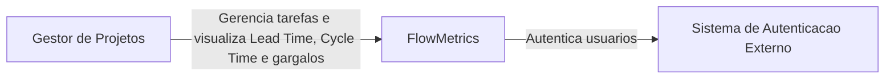
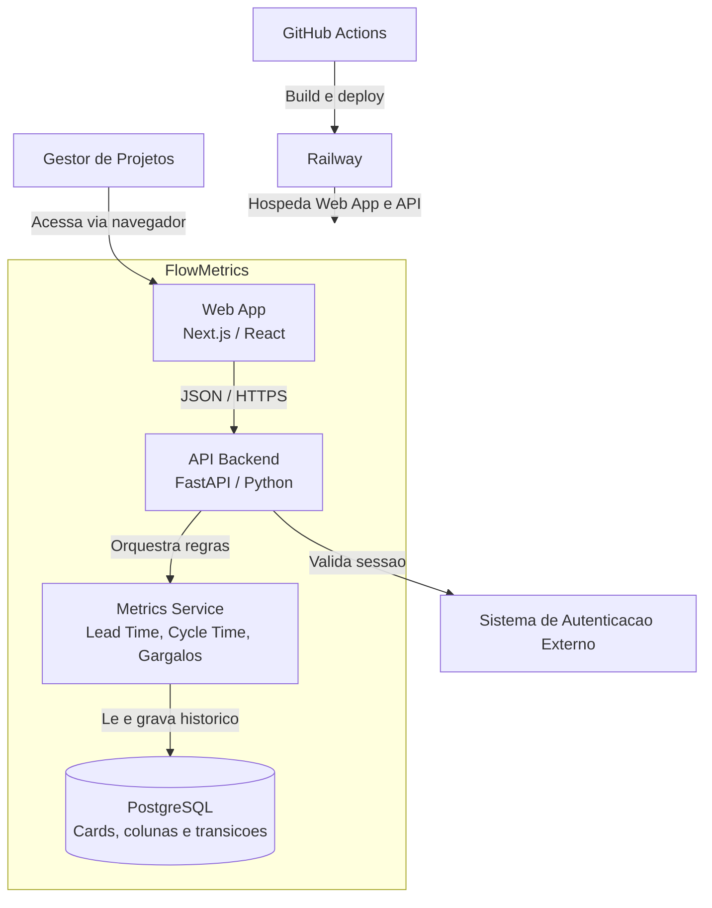
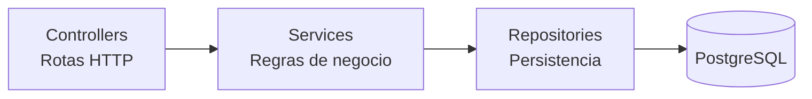
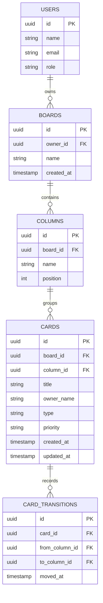

# Arquitetura - FlowMetrics MVP

## C4 - Nivel 1: Contexto

## C4 - Nivel 2: Containers

## Camadas internas

## Modelo de dados essencial

## Decisoes arquiteturais

- O historico de transicoes e a fonte da verdade para metricas de fluxo.
- Lead Time e calculado da criacao do card ate a entrada em Concluido.
- Cycle Time e calculado da entrada em Em Progresso ate a entrada em Concluido.
- Gargalo e calculado pela maior permanencia media por coluna.
- O MVP local usa LocalStorage para demonstracao rapida; em producao, a mesma regra vai para FastAPI + PostgreSQL.
- A separacao Controller / Service / Repository evita que a regra de calculo fique presa na interface.
