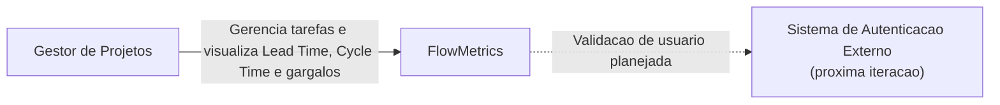
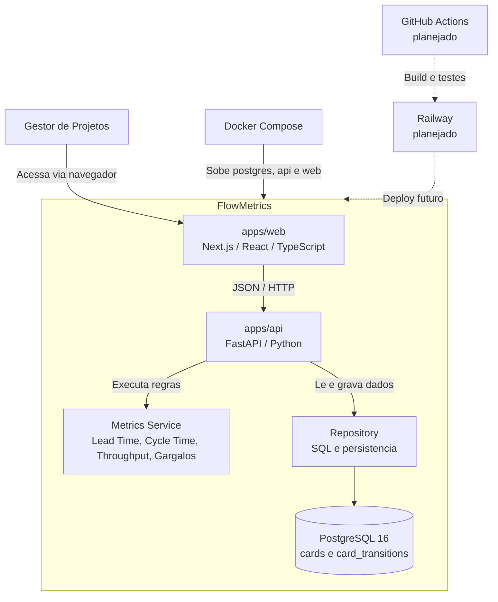
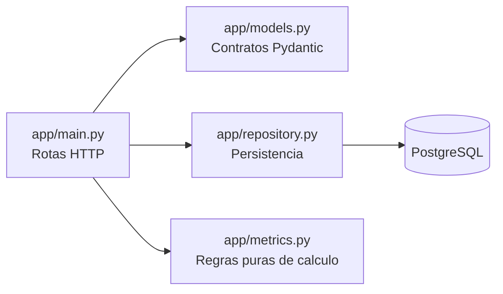
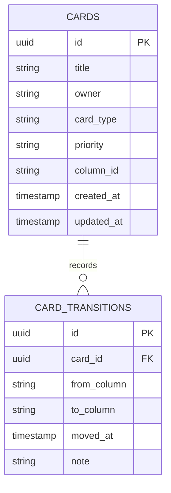

# Arquitetura - FlowMetrics MVP

## C4 - Nivel 1: Contexto

## C4 - Nivel 2: Containers

## Camadas internas da API

## Modelo de dados implementado

## Decisoes arquiteturais

- O historico de transicoes e a fonte da verdade para metricas de fluxo.
- Lead Time e calculado da criacao do card ate a entrada em Concluido.
- Cycle Time e calculado da primeira entrada em Em Progresso ate a entrada em Concluido.
- Throughput considera cards concluidos nos ultimos 7 dias.
- Gargalo e calculado pela maior permanencia media por coluna.
- A API separa rotas, modelos, repositorio e calculo de metricas para evitar regra de negocio presa na interface.
- O MVP atual ja usa Next.js, FastAPI e PostgreSQL; a versao estatica em `mvp/` ficou apenas como fallback.
- Autenticacao externa, CI/CD e deploy Railway estao documentados como evolucao natural da proposta original.
