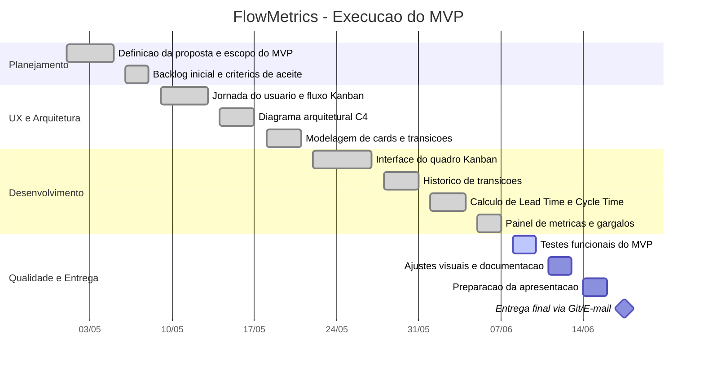

# Diagrama de Gantt - FlowMetrics

## Etapas percorridas

| Etapa | Periodo | Resultado |
| --- | --- | --- |
| Planejamento | Maio, semana 1 | Escopo do MVP e proposta de valor definidos |
| UX e arquitetura | Maio, semanas 2 e 3 | Fluxo do usuario, C4 e modelo de eventos |
| Desenvolvimento | Maio/Junho | Kanban, auditoria e metricas funcionais |
| Qualidade | Junho, semana 2 | Validacao do fluxo, revisao e ajustes |
| Entrega | Junho | Apresentacao, Git/E-mail e demonstracao do MVP |
